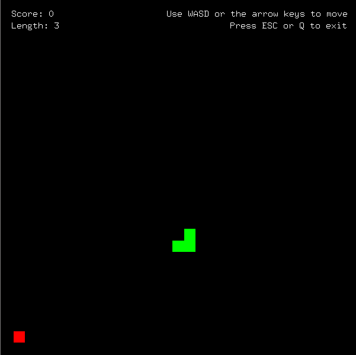
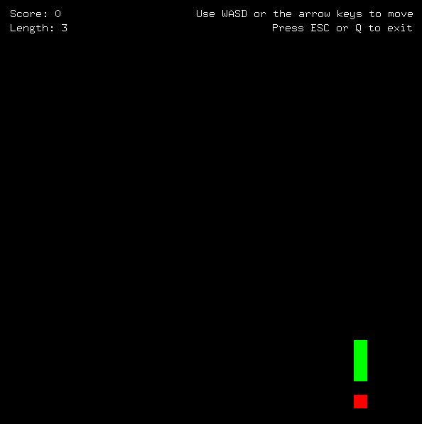
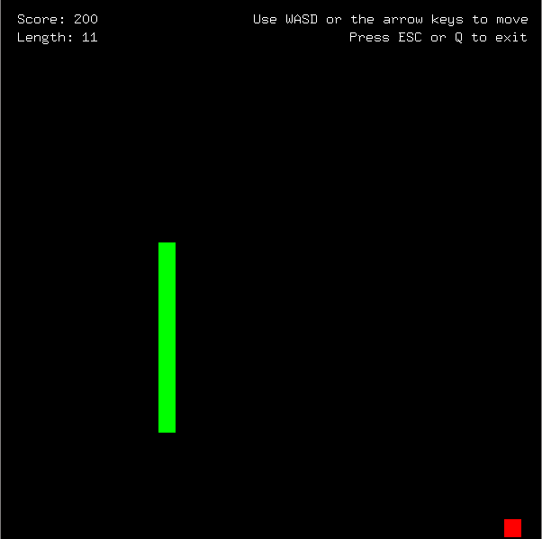

# CG Mini Project Assignment

> Vinodkumar G
> 1BY18CS189

> Shrivathsa P
> 1BY18CS160

> 6SEM CSE 2022

## Snake Game

A Computer Graphics and Visualisation Mini Project to simulate a retro arcade game on Nokia handsets called `"Snake"`.

## Features
* Uses GLUT, GLEW.
* This program is a classic snake game in GLUT.
* Snake movement using WASD.
* Collect food to grow in size and increase score.
* Beware! Don't hit the walls or bite yourself!


## Usage

#### Clone and build:
```bash
git clone "https://github.com/v1n0dkumarg/CG-assignment.git"
cd CG-assignment
codeblocks Snake-Game.cbp
```
#### Running:
```bash
Build, Run and Enjoy!
```




